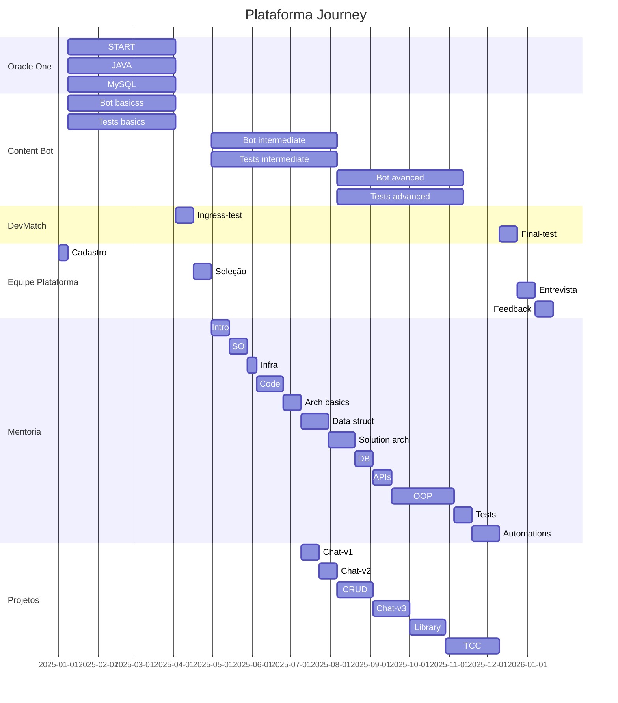
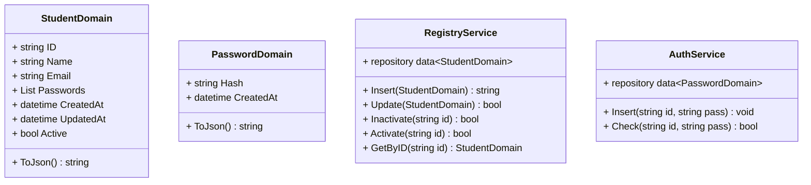
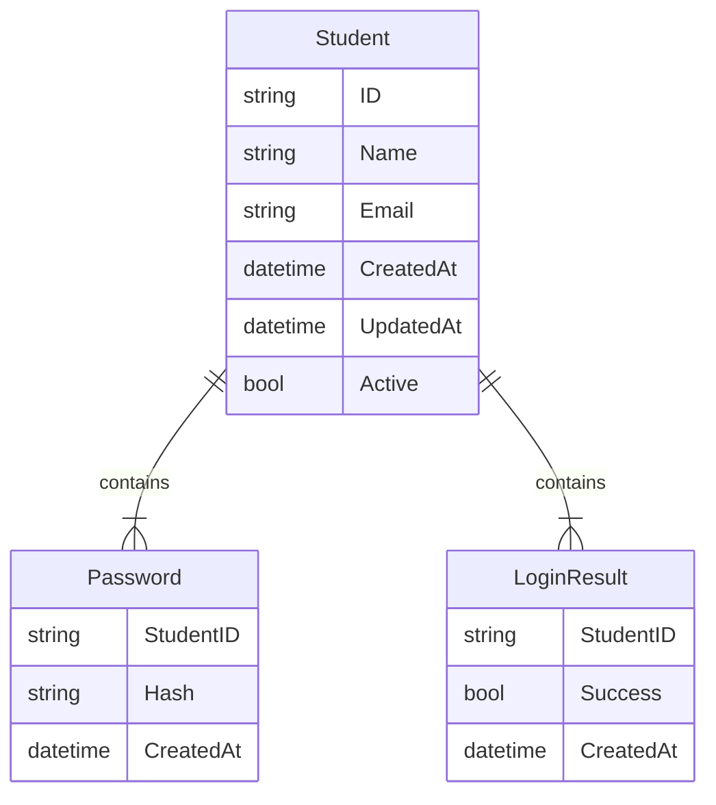
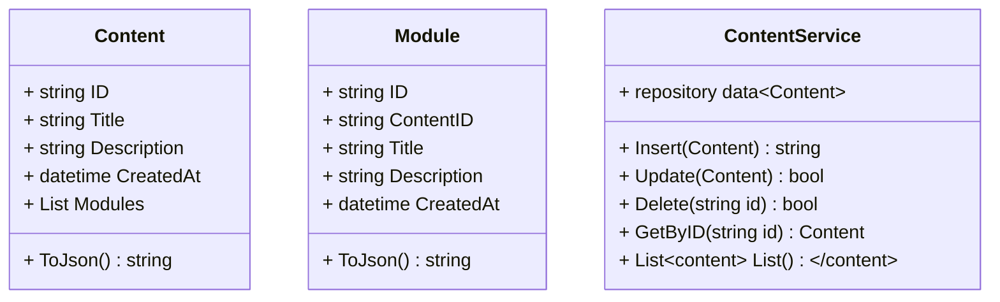
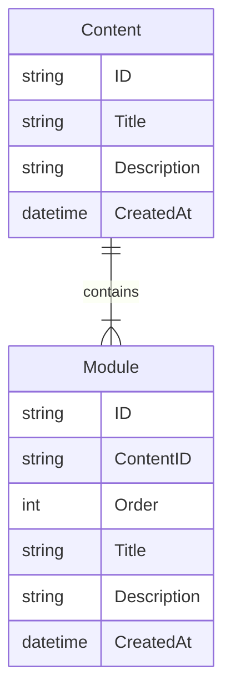
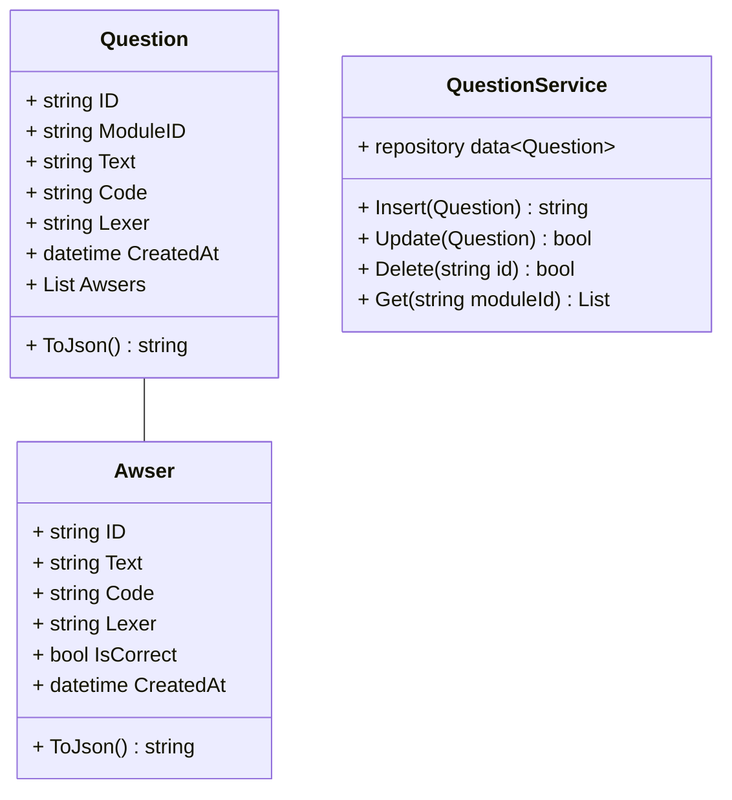
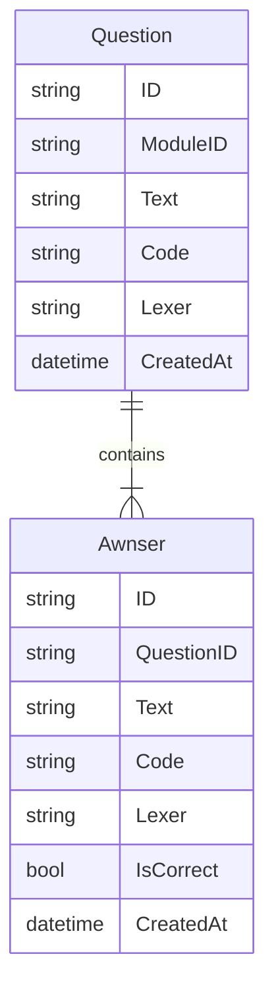
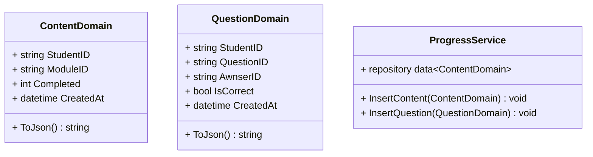

# Plataforma-Journey
Um projeto de plataforma de ensino a distância, com o objetivo de ajudar pessoas a aprenderem novas habilidades e conhecimentos. Focando em preparar pessoas para o mercado de trabalho, tanto na parte técnica como na parte comportamental.

Para maiores informações sobre o projeto, acesse o nosso [site](https://plataformaimpact.org/)

## Contexto
Visando termos escalabilidade e impacto social, o projeto da Plataforma Journey foi criado para dar um caminho de forma automatizada e apoiar nossos estudantes usando ferramentas de tecnologia para que consigam se desenvolver e de forma autonoma e com qualidade. Queremos trazer para um ambiente virtual toda as qualidades que conseguimos entregar por meio de mentorias presenciais ou remotas.

## Objetivo
Queremos que toda a jornada que nossos estudantem devem trilhar sejam claros e objetivos e que com esse projeto, tenham todas as ferramentas necessárias para isso.

Queremos usando motorores de IA, gerar conteúdos de qualidade, exercícios e testes para orientar os próximos passos e pontos de foco nos estudos.

## Nossa trilha


## Estrutura do projeto
O projeto possui alguns módulos, que são:
- **Oracle One**: Trilha inicial, o estudante aqui precisa demonstrar comprometimento e dedicação. Mostrar que é capaz de aprender e se desenvolver sozinho usando recursos online.
- **Content Bot**: Plataforma de nossa autoria onde colocamos todos os conteúdos que entendemos que são a base do necessário para preparar os estudantes para o mercado de trabalho. Esses conteúdos foram desenvolvidos baseados nas experiências que tivemos com as turmas passadas e com o auxílio de IA conseguimos gerar conteúdos de qualidade.
- **DevMatch**: Plataforma que usamos para aplicar testes de simulação de cenários de trabalho real, para que possamos avaliar o conhecimento técnico dos estudantes.
- **Mentoria**: Programa extenso e intensivo de acompanhamento dos alunos que conseguirem passar pelas fases iniciais. Aqui é onde conseguimos extrair o melhor dos nossos alunos apresentando desafios reais e acompanhando o desenvolvimento deles. Especialistas renomados de mercado puxam essas mentorias, que vão muito além de serem apenas aulas técnicas, são aulas de vida e de carreira.

## Arch
### RegistryService
#### Classes

#### MER

### ContentService
#### Classes

#### MER


### QuestionService
#### Classes

#### MER


### ProgressService
#### Classes

#### MER
```mermaid
erDiagram
    Content {
        datetime CreatedAt
        string ContentID
        string SudentID
        string ModuleID
        int Completed // percent    
    }

    Question {
        datetime CreatedAt
        string StudentID
        string QuestionID
        string AwnserID
        bool IsCorrect        
    }
```