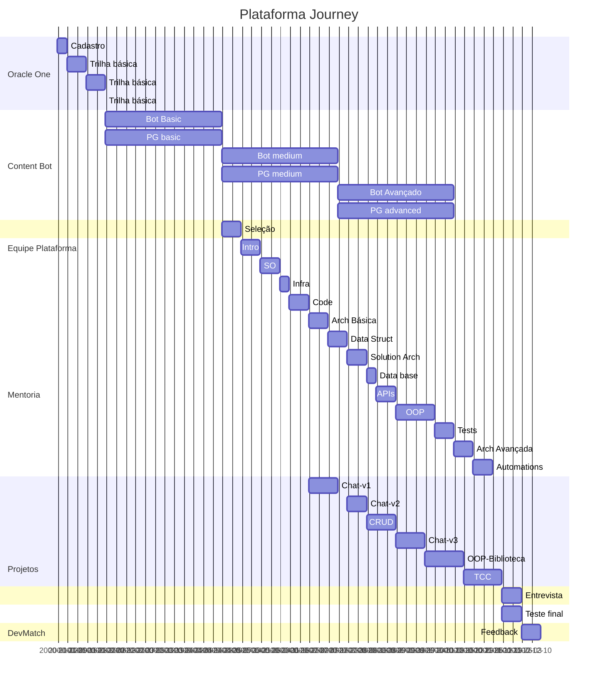

# Plataforma-Journey
Um projeto de plataforma de ensino a distância, com o objetivo de ajudar pessoas a aprenderem novas habilidades e conhecimentos. Focando em preparar pessoas para o mercado de trabalho, tanto na parte técnica como na parte comportamental.

Para maiores informações sobre o projeto, acesse o nosso [site](https://plataformaimpact.org/)

## Contexto
Visando termos escalabilidade e impacto social, o projeto da Plataforma Journey foi criado para dar um caminho de forma automatizada e apoiar nossos estudantes usando ferramentas de tecnologia para que consigam se desenvolver e de forma autonoma e com qualidade. Queremos trazer para um ambiente virtual toda as qualidades que conseguimos entregar por meio de mentorias presenciais ou remotas.

## Objetivo
Queremos que toda a jornada que nossos estudantem devem trilhar sejam claros e objetivos e que com esse projeto, tenham todas as ferramentas necessárias para isso.

Queremos usando motorores de IA, gerar conteúdos de qualidade, exercícios e testes para orientar os próximos passos e pontos de foco nos estudos.

## Nossa trilha

