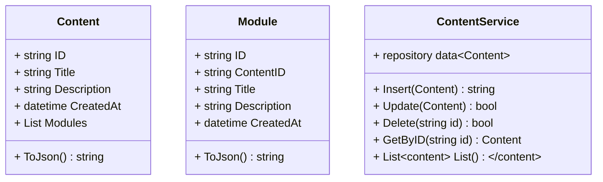
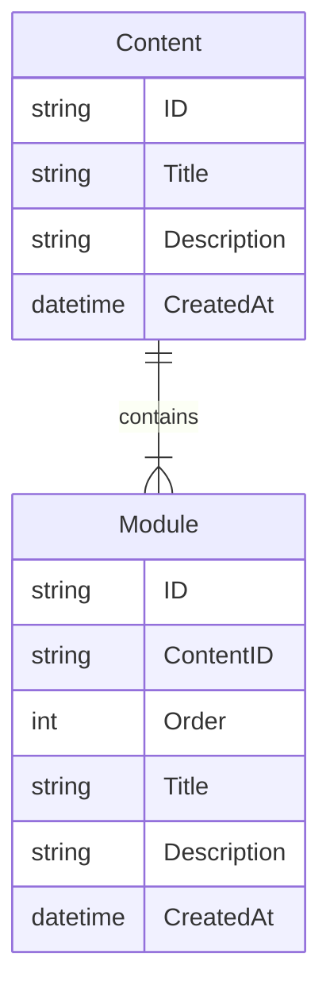

# ContentService
## Classes

## MER

## CV
Tópicos para uma base sólida de profissional de tecnologia
- Fundamentos de tecnologia
    - O que é um computador
    - O que ele faz
    - Quais são os componentes básicos de um computador
    - Bases numéricas
        - Binários e Hexadecimais
    - Tipos de dados
        - Números
        - Caracteres
        - Strings
        - Booleanos
    - A História básicas que explica algumas coisas importantes do que temos hoje
    - O que é memória RAM
    - O que é um Storage
    - O que é uma CPU
        - Arquiteturas de CPU (X86,Arm e etc)
        - História, funcionamento básicos
    - Sistemas operacionais
        - O que são, oq fazem, a história até aqui e pq são como são
        - Arquiteturas dos principais: Windows, Linux, macOS, Android, iOS, Unix, BSD
        - A História e como chegamos aos dias de hoje
    - O que é um servidor
    - O que é uma rede
    - O que é um DataCenter
    - O que é Virtualização        
        - O que é uma VM
            - Hipervisor e QVM
            - VirtualBox
            - VMWare
            - qEMU
        - O que é um Container            
            - Docker
            - Compose
    - Tipos de programas:
        - Scripts / Interpretados
        - Com Máquina Virtual
        - Compilados
- Terminal
    - Operação básica
    - Comandos básicos
    - O que é um shell
    - O que é um terminal
    - Interpretadores a gosto do freguês: 
        - SH
        - Bash
        - Zsh
        - Fish
        - PowerShell
    - Interfaces para agradar a todos:
        - Linux:        
            - Gnome Terminal
            - Konsole
            - Hyper
            - Alacritty
            - XFCE Terminal
            - Terminator
            - Guake
            - Kitty
        - macOS:
            - XTerm
            - iTerm
        - Windows: 
            - CMD
            - PowerShell
            - Cmder
            - ConEmu
            - Windows Terminal
- Git
    - O que é
    - História
    - Como funciona
    - Comandos básicos
    - Como usar
    - O que é um repositório
    - O que é um branch
    - O que é um commit
    - O que é um merge    
    - Gitflow: 
        - O que é um pull request
        - O que é um merge request        

- Código:
    - Variáveis
        - Alocação de memória
        - Tipos
            - Números, caracteres, strings e tipos complexos
    - Algorítimos
        - If/Else
        - Loops/Repetições
        - Funções
        - Estrutura básica de código
    - Estruturas de dados
        - Arrays
        - Listas
            - Tipos de listas
        - Mapas
    - Comparativos
    - Algorítimos de busca
    - Notação de complexidade (Big O)

- Arquiteturas básicas de uma solução
    - Onde ela acontece
    - Onde as coisas ficam
    - O que é um servidor
    - Como usar um Docker e por que isso vai te ajudar
    - O que é um servidor de aplicação
    - O que é um servidor de banco de dados
    - O que é um servidor de mensageria
    - O que é qlqr outro tipo de recurso: Noções de SaaS, PaaS, IaaS

- Bancos de dados
    - Modelagem básica de dados
    - O que é SQL e noSQL
    - Como modelar algo
    - Como inserir dados lá
    - Como consultar seus dados
    - Como alterar seus dados
    - Como apagar seus dados

- Noções de Orietação a objeto
    - Onde fica cada coisa na sua aplicação
    - Como segregar as coisas e estruturar seu código, onde colocar seus métodos
    - Noções de classes, heranças, interfaces
    - Afinal, oq é esse objeto q tanto falam?
    - DDD
    - Interfaces
    - Abstrações
    - Modelando aplicações e classes
    - SOLID

- Vendo isso na prática: O CRUD

- Arquitetura de serviços
    - O que é um serviço
    - Noções de arquitetura de solução: Onde fica cada coisa
    - Como eles se conversam?
    - Mensagerias    
    - Quem faz oq em modelos mais complexos?
    - SOLID
    - Arquiteturas sincronas e assincronas
    - Eventos
    - Cache
    - Modelos distribuídos

## Timeline 
MS-DOS: Microsoft Disk Operational System -> Sistema operacional de disco da Microsoft
	Intel 8086: 64K RAM -> 64K bytes - 1981
		Tamanho máximo de memória que o MS-DOS Endereça é de 640K

	1983: 1Mb RAM
	1984: 4MB RAM -> HIMEM.sys -> High Memory System
		-> 2Gb RAM
		-> Usuários únicos
		-> Sem permissionamento

		A: SO / B: APP / C: HARD DRIVE DISK
			Disquete: 360k até 2MB espaço
			HDD: 50MB +++++
	1985: Drivers em modelo aberto (16bits)

	1989:
		Mainframes -> Computadores gigantes
		Medio porte -> AS/400 -> UNIX -> Berkley -> BSD -> POSIX
		Micro computadores -> MS-DOS

		Finlandes Linus Torvalds -> Unix do Linus -> Universidade de Helsinki -> 80386 em 32 bits -> LINUX -> OPEN SOURCE

	1992: Windows 3.11
		Windows 3.0 -> Versão inicial do 3.0
		Windows 3.1 -> Pacote de software completo (até 16 bits)
		Windows 3.11 -> instruções em 32 bits

	1994: Compact Disk -> CD -> 650MB -> D:
		A: / C: / D:

	1995: CD -> C: / D: -> Windows 95 _> Interface nova, 32 bits nativo, drivers em 32 bits, nova camada de rede, Abstraia o MS-DOS
	1996: VIVAAAA INTERNET!!!
		Windows NT
		-> Servidores com Linux

		Sua próprio distro!!!! tenha um linux para chamar de seu
	1998: 
		Um windows mais pensado para internet
		iMac: macOS: SO POSIX, Kernel compativel com UNIX
		
	2000: começando do zero: Refizeram um windows para servidores
		Windows XP -> Windows doméstico baseado no Windows 2000... havia um grande problema: RETROCOMPATIBILIDADE
		Linux -> Colaboraçao mundial para evolução

		...

		Server = Linux

	2004: Windows Server
	2007: iPhone: iOS -> SO POSIX
	2008: Android: SO POSIX -> Linux Like
	2009: Windows 7 -> Novo kernel, Nova interface, novo motor de drivers....... RETROCOMPATIBILIDADE

		...
	
	2013: Docker 
	
	
		