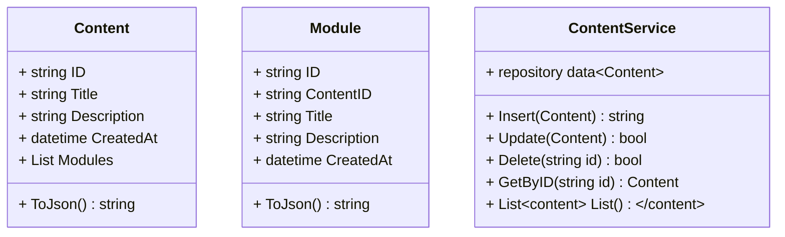
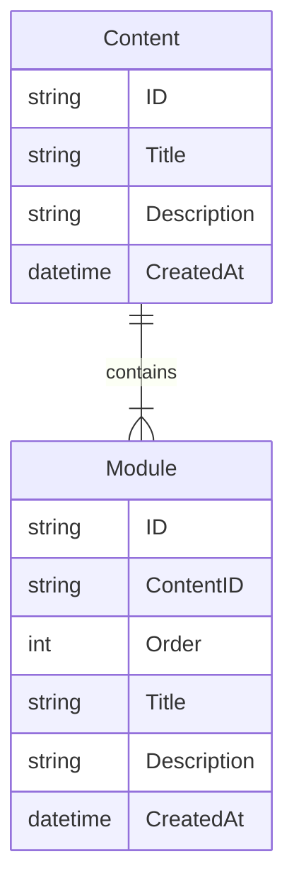

# ContentService
## Classes

```mermaid
classDiagram
    class Content {
        + string ID
        + string Title
        + string Description
        + datetime CreatedAt
        + List<Module> Modules
        + ToJson() string
    }

    class Module {
        + string ID
        + string ContentID
        + string Title
        + string Description
        + datetime CreatedAt
        + ToJson() string
    }

    class ContentService {
        + repository data~Content~
        + Insert(Content) string
        + Update(Content) bool
        + Delete(string id) bool
        + GetByID(string id) Content
        + List<Content> List()
    }
```
## MER

```mermaid
erDiagram
    Content {
        string ID
        string Title
        string Description
        datetime CreatedAt
    }

    Module {
        string ID
        string ContentID
        int Order
        string Title
        string Description
        datetime CreatedAt
    }

    Content ||--|{ Module : contains
```