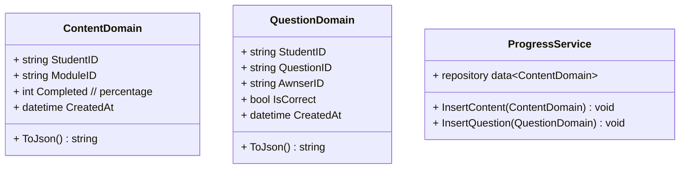
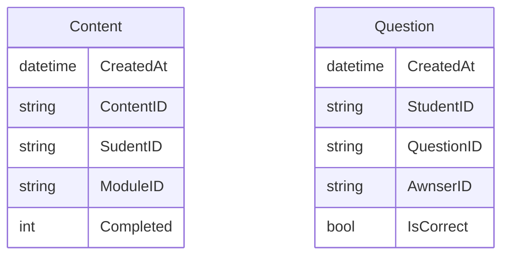

# ProgressService
## Classes

```mermaid
classDiagram
    class ContentDomain {
        + string StudentID
        + string ModuleID
        + int Completed // percentage
        + datetime CreatedAt
        + ToJson() string
    }

    class QuestionDomain {
        + string StudentID
        + string QuestionID
        + string AwnserID
        + bool IsCorrect
        + datetime CreatedAt
        + ToJson() string
    }

    class ProgressService {
        + repository data~ContentDomain~
        + InsertContent(ContentDomain) void
        + InsertQuestion(QuestionDomain) void
    }
```
## MER

```mermaid
erDiagram
    Content {
        datetime CreatedAt
        string ContentID
        string SudentID
        string ModuleID
        int Completed
    }

    Question {
        datetime CreatedAt
        string StudentID
        string QuestionID
        string AwnserID
        bool IsCorrect        
    }
```