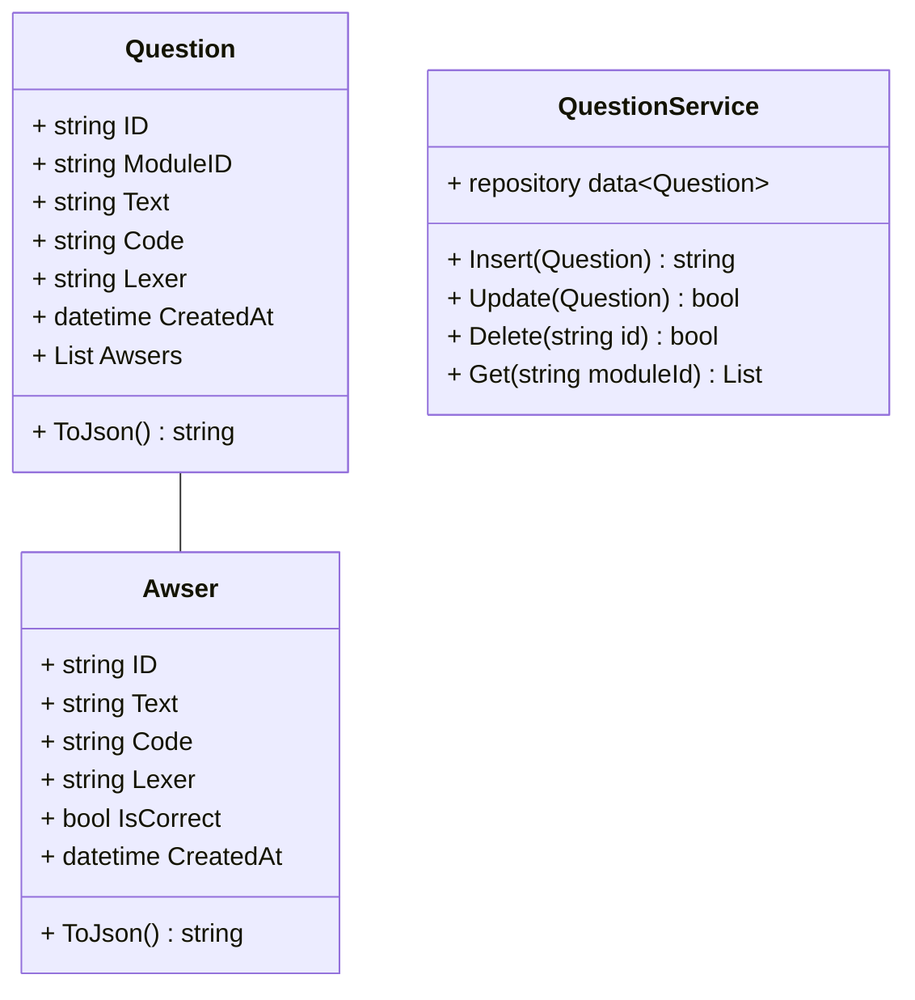
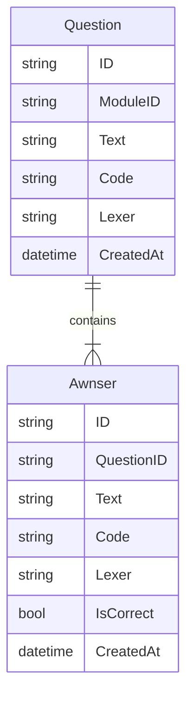

# QuestionService
## Classes

```mermaid
classDiagram
    class Question {
        + string ID
        + string ModuleID        
        + string Text
        + string Code
        + string Lexer
        + datetime CreatedAt
        + List<Awser> Awsers
        + ToJson() string
    }

    class Awser {
        + string ID
        + string Text
        + string Code
        + string Lexer
        + bool IsCorrect
        + datetime CreatedAt
        + ToJson() string
    }

    Question -- Awser

    class QuestionService {
        + repository data~Question~
        + Insert(Question) string
        + Update(Question) bool
        + Delete(string id) bool
        + Get(string moduleId) List<Question>
    }
```
## MER

```mermaid
erDiagram
    Question {
        string ID
        string ModuleID
        string Text
        string Code
        string Lexer
        datetime CreatedAt
    }

    Awnser {
        string ID
        string QuestionID
        string Text
        string Code
        string Lexer
        bool IsCorrect
        datetime CreatedAt
    }

    Question ||--|{ Awnser : contains
```

