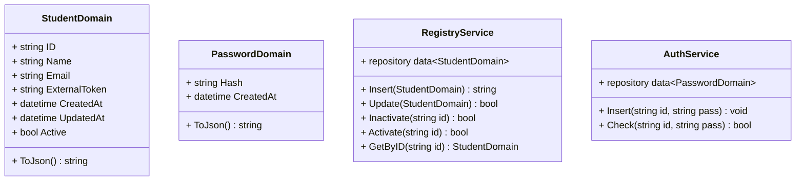
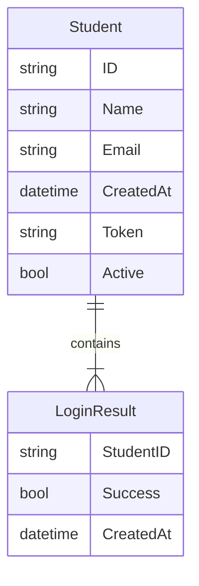

# RegistryService
## Classes

```mermaid
classDiagram
    class StudentDomain {
        + string ID
        + string Name
        + string Email
        + string ExternalToken
        + datetime CreatedAt
        + datetime UpdatedAt
        + bool Active
        + ToJson() string
    }

    class PasswordDomain {
        + string Hash        
        + datetime CreatedAt
        + ToJson() string
    }

    class RegistryService {
        + repository data~StudentDomain~
        + Insert(StudentDomain) string
        + Update(StudentDomain) bool
        + Inactivate(string id) bool
        + Activate(string id) bool
        + GetByID(string id) StudentDomain
    }

    class AuthService {
        + repository data~PasswordDomain~
        + Insert(string id, string pass) void
        + Check(string id, string pass) bool        
    }
```
## MER

```mermaid
erDiagram
    Student {
        string ID
        string Name
        string Email
        datetime CreatedAt
        string Token
        bool Active
    }

    LoginResult {
        string StudentID
        bool Success
        datetime CreatedAt
    }

    Student ||--|{ LoginResult : contains
```

